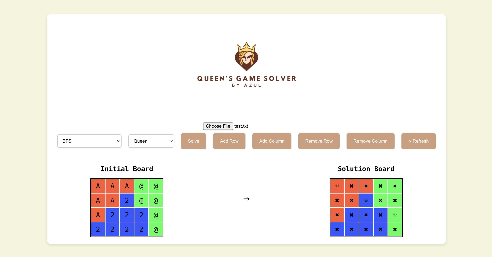

<!-- INTRO -->
<br />
<div align="center">
  <h1 align="center">Tugas 2 Seleksi IRK : Queens Game Solver</h1>

  <p align="center">
    <h3> Penyelesaian Permainan Queens Menggunakan Algoritma BFS, DFS, dan Constraint Programming</h3>
    <p>Program made using Javascript</p>
    <br />
    <a href="https://github.com/zultopia/Task2-QueensGameSolver-13522070.git">Report Bug</a>
    ·
    <a href="https://github.com/zultopia/Task2-QueensGameSolver-13522070.git">Request Feature</a>
<br>
<br>

[![MIT License][license-shield]][license-url]

  </p>
</div>

<!-- CONTRIBUTOR -->
<div align="center" id="contributor">
  <strong>
    <h3>Dibuat oleh :</h3>
    <table align="center">
      <tr>
        <td>NIM</td>
        <td>Nama</td>
      </tr>
     <tr>
        <td>Marzuli Suhada M</td>
        <td>13522070</td>
    </tr>
    </table>
  </strong>
</div>

## Deskripsi Aplikasi

Queens Game Solver adalah aplikasi yang dirancang untuk menyelesaikan permainan Queens Game, yang menantang pengguna untuk mengalokasikan sebuah "Queen" atau bidak catur lainnya pada setiap region warna di papan, mengikuti aturan-aturan tertentu. Aplikasi ini menerima input papan dari file .txt, menampilkan solusi pada GUI, dan mendukung beberapa algoritma pencarian solusi serta modifikasi langsung pada papan.

## Algoritma yang Digunakan

  ### BFS (Breadth-First Search)
  BFS adalah algoritma pencarian yang menjelajahi graf/ruang solusi secara level per level. BFS cocok untuk menemukan solusi dengan pendekatan eksplorasi yang luas terlebih dahulu, yang memastikan solusi ditemukan dengan rute terpendek dalam konteks pencarian layer demi layer. Alasan BFS digunakan karena sederhana dan menjamin solusi ditemukan dengan rute terpendek.

  ### Greedy Best-First Search (GBFS)
  DFS adalah algoritma pencarian yang menjelajahi graf/ruang solusi dengan menjelajahi sedalam mungkin setiap cabang sebelum mundur. DFS efektif untuk eksplorasi dalam yang lebih dalam terlebih dahulu, memungkinkan solusi ditemukan dengan cepat jika solusi tersebut berada di dalam cabang awal yang dijelajahi. Alasan DFS digunakan karena dapat lebih cepat menemukan solusi dalam beberapa kasus dengan struktur pohon solusi tertentu.

  ### Constraint Programming (CP) 
  CP menggunakan pendekatan deklaratif untuk menyelesaikan masalah dengan mendefinisikan kendala yang harus dipenuhi oleh solusi. CP sangat kuat untuk masalah dengan banyak kendala seperti penempatan Queen yang tidak saling menyerang dan alokasi dalam region yang tetap.Alasan CP digunakan karena fleksibilitasnya dalam menangani kendala kompleks dan menyediakan pendekatan sistematis untuk masalah penempatan.

## Struktur Program

```
    queens-game-solver/
    ├── public/
    │   ├── index.html
    ├── src/
    │   ├── components/
    │   │   ├── Board.css
    │   │   ├── Board.js
    │   │   ├── FileInput.js
    │   ├── images/
    │   │   ├── Logo.png
    │   ├── util/
    │   │   ├── Algorithms.js
    │   │   ├── Colors.js
    │   ├── App.js
    │   ├── App.css
    │   ├── index.js
    │   ├── index.css
    ├── README.md
    ├── package.json
```

## Teknologi, Bahasa, dan Framework yang Digunakan

1. Bahasa Pemrograman: JavaScript
2. Framework: React.js untuk antarmuka pengguna (GUI)
3. Library:
    - React untuk pembangunan komponen UI.
    - FileReader untuk membaca file .txt.

## How to Run Program
1. Clone Repository
    ```
    git clone https://github.com/username/QueensGameSolver.git
    cd QueensGameSolver
    ```

2. Instalasi dependensi
    ```
    npm install
    ```

3. Jalankan aplikasi
    ```
    npm start
    ```

4. Upload file .txt
    ```
    Format file .txt:
    4 5
    3
    A A A @ @
    A A 2 @ @
    A 2 2 2 @
    2 2 2 2 @
    ```

5. Pilih algoritma dan bidak catur
    ```
    Pilih algoritma (BFS, DFS, CP) dan Queen standar atau bidak catur (Queen, Rook, Bishop, Knight).
    ```

6. Klik 'Solve' untuk melihat solusi.

## Referensi Belajar
1. [React Documentation](https://legacy.reactjs.org/docs/getting-started.html)
2. [MDN Web Docs - FileReader](https://developer.mozilla.org/en-US/docs/Web/API/FileReader)
3. [GeeksforGeeks - BFS Algorithm](https://www.geeksforgeeks.org/breadth-first-search-or-bfs-for-a-graph/)
4. [GeeksforGeeks - DFS Algorithm](https://www.geeksforgeeks.org/depth-first-search-or-dfs-for-a-graph/)
5. [GeeksforGeeks - Constraint Satisfaction Problems](https://www.geeksforgeeks.org/constraint-satisfaction-problems-csp-in-artificial-intelligence/)

## Screenshots
<!-- GUI Illustration -->
<div align="center">
  <h2>Graphical User Interface (GUI) Tampak Atas</h2>
  
</div>

<!-- LICENSE -->
## Licensing

The code in this project is licensed under MIT license.  

<br>
<h3 align="center"> THANK YOU! </h3>

<!-- MARKDOWN LINKS & IMAGES -->
<!-- https://www.markdownguide.org/basic-syntax/#reference-style-links -->
[license-shield]: https://img.shields.io/github/license/othneildrew/Best-README-Template.svg?style=for-the-badge
[license-url]: https://github.com/zultopia/Task2-QueensGameSolver-13522070/blob/main/LICENSE